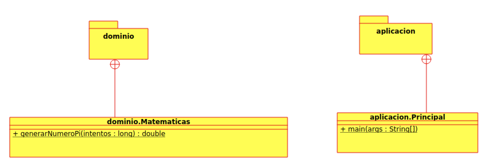

Copyright [2022] [Daniel Fernández López] 
Licensed under the Apache License, Version 2.0 (the "License");
you may not use this file except in compliance with the License.
You may obtain a copy of the License at

    http://www.apache.org/licenses/LICENSE-2.0

Unless required by applicable law or agreed to in writing, software distributed
under the License is distributed on an "AS IS" BASIS, WITHOUT WARRANTIES OR CONDITIONS
OF ANY KIND, either express or implied. See the License for the specific language governing
permissions and limitations under the License.


# MontecarloPi2022

# Creador: 
* Daniel Fernández López

# Objetivo:

Este programa ha sido diseñado para poder realizar una aproximación al número Pi a partir del método de Monte Carlo.

El método de Monte Carlo consiste en inscribir una circunferencia dentro un cuadrado, (siendo el diámetro de la circunferencia igual que uno de los lados del cuadrado) y mediante la generación de puntos aleatorios sobre la superficie dibujada se establece una relación entre los puntos interiores (aciertos) y puntos totales; con la que se podrá llevar a cabo la aproximción al número Pi.

Además, suponemos que ambas figuras se encontrarán representadas en los ejes de coordenadas (X) e (Y), situando el centro de la circunferencia en el punto (0,0) y los cuatro vértices del cuadrado en los puntos (-1,-1), (-1,1), (1,-1), (1,1). Por lo tanto, el valor del radio será igual a 1 y el valor del área del cuadrado igual a 4.

* Área Circulo = Pi * R^2
* Área Cuadrado = L^2

En el programa se establecen unos valores iniciales de aciertos e intentos que se van incrementando a partir de los bucles "for" e "if" a medida que se generan puntos aleatorios sobre la superficie. Constituyendo finalmente, la aproximación al número Pi como la división entre el área del cuadrado y el radio de la circunferencia al cuadrado.
# Funcionalidad:

* Para inicializar el programa deberá introducir en el terminal el  el número de intentos que desea efectuar para llevar a cabo la aproximación

* Una vez ejecutado el comando se imprimirá por pantalla el resultado de la aproximación.

# Comandos:

* Ejecución código: 
```shell
java -jar ap-Matematicas.jar X 
```
Donde X determina el número de intentos, por ejemplo 1000.

* Compilación código:
```shell
make compilar
```

* Creación jar: 
```shell
make jar 
```

* Creación Javadoc: 
```shell
make javadoc
```




